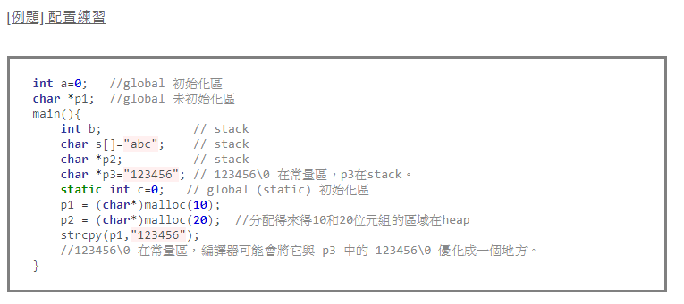
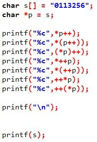

# 基本指標判讀:
```
int a; // 一個整型數
int *a; // 一個指向整數的指標
int **a; // 一個指向指標的指標，它指向的指標是指向一個整型數
int a[10]; // 一個有10個整數型的陣列
int *a[10]; // 一個有10個指標的陣列，該指標是指向一個整數型的
int (*a)[10]; // 一個指向有10個整數型陣列的指標
int (*a)(int); // 一個指向函數的指標，該函數有一個整數型參數並返回一個整數
int (*a[10])(int); // 一個有10個指標的陣列，該指標指向一個函數，該函數有一個整數型參數並返回一個整數

注意宣告兩個指標時不能寫做 int* a, b; 因為前式等價於 int* a; int b;。連續宣告兩個指標用 int *a, *b;
```
  
  
  
  
# 指標與其他關鍵字混用
```
一樣右讀到左，例如：
	const int * foo; // 一個 pointer，指向 const int 變數。
	int const * foo; // 一個 pointer，指向 const int 變數。
	int * const foo; // 一個 const pointer，指向 int 變數。
	int const * const foo; // 一個 const pointer，指向 const int 變數。	
關鍵字 volatile 等等判讀方式相同。
```
  
    
  
# 變數範圍和生命周期（關鍵字 static）
```
1. local 變數 : local 變數僅活在該函式內，存放位置在 stack 或 heap 記憶體中。

2. static 變數 : static 變數生命周期 (life time) 跟程式一樣長，而範圍 (scope) 則維持不變，即在宣告的函式之外仍無法存取 static 變數。

3. global 變數 : 所有區段皆可使用此變數。
```
```
Stack : 存放函數的參數、區域變數等，由空間配置系統自行產生與回收。(會稱作 stack 是由於其配置遵守 LIFO)
Heap : 一般由程式設計師分配釋放，執行時才會知道配置大小，如 malloc/new 和 free/delete。(注意其資料結構不是 DS 中的 heap 而是 link-list)
Global : 包含 BSS (未初始化的靜態變數)、data section (全域變數、靜態變數) 和 text/code (常數字元)。
```
> 
>     


# call by value, call by reference
```
1. call by value : 最常見的函式寫法，呼叫者和被呼叫者的變數各自佔有記憶體，將參數複製再傳給函式。

2. call by reference : 呼叫者和被呼叫者的變數使用相同的記憶體位址，因此在被呼叫函式中改變變數時，變動結果會保留。(C++ 才有，寫法為 type func(type &var) { ... })
```
  
    
      
# 關鍵字 const
```
const 通常表示只可讀取不可寫入的變數，常用來宣告常數。使用 const 有以下好處：
	1.提升程式碼可讀性
	2.使編譯器保護那些不希望被改變的參數
	3.給優化器一些附加的資訊	
```
   
      
        
# const vs #define
```
編譯器處理方式 : define 在預處理階段展開；const 在編譯階段使用。
類型和安全檢查 : const 會在編譯階段會執行類型檢查，define 則不會。
存儲方式 : define 直接展開不會分配記憶體，const 則會在記憶體中分配。
```
  
    
      
# 巨集 #define
>    
     
       
# 引入防護和條件編譯
> 
  
    
      
# 關鍵字 inline
```
inline 可以將修飾的函式設為行內函式，即像巨集 (define) 一樣將該函式展開編譯，用來加速執行速度。

inline 和 #define 的差別在於：
inline 函數只對參數進行一次計算，避免了部分巨集易產生的錯誤。
inline 函數的參數類型被檢查，並進行必要的型態轉換。
巨集定義盡量不使用於複雜的函數
用 inline 後編譯器不一定會實作，僅為建議。
```

    
      
# 關鍵字 volatile
```
由於嵌入式系統常處理 I/O、中斷、即時操作系統 (RTOS) 相關的問題，因此在嵌入式系統開發中 volatile 尤為重要。被 volatile 修飾的變數代表它可能會被不預期的更新，因此告知編譯器不對它涉及的地方做最佳化，並在每次操作它的時候都讀取該變數實體位址上最新的值，而不是讀取暫存器的值。

volatile 常見的應用：

修飾中斷處理程式中 (ISR) 中可能被修改的全域變數。
修飾多執行緒 (multi-threaded) 的全域變數。
設備的硬體暫存器 (如狀態暫存器)
```

      
        
# 寫出將會印出的兩行字串
> 
```
答案為:
第一行字串為 : 0113234
第二行字串為 : 0123456

首先, *p = s 所代表的含意為 pointer p 指向字串s的第一個位址,
字串s第一個位址值為0,而接下來一連串的運算可分成以下四類:
```
> 
```
雖然看似複雜,但仔細觀察還是可看出規則,
*p = 取值
p = 取指標位址
++在前  =  先加1再取值
++在後  =  先取值後加1
```
  
    
    
# write your own strcmp 
``` 
int ownstrcmp(char a[], char b[])  
{   
   int i = 0; 
   while( a[i] == b[i] )   
   { 
      if( a[i] == '\0' )  
        return 0; 
      ++i; 
   } 
   return  ( a[i] < b[i]) ? 1 : -1; 
}   
```
  
  
  
# 請問以下何者為不合法的變數名稱?
#### 1. _aB        2. AB        3. 2ab        4. A_B        5. Black        6.  Break
```
Ans: 3
(Note : 第六選項  "Break" 因為是大寫 B 與 "break"被視為兩個不同的變數，故雖不建議使用，但依然被視為合法變數)
1. 變數名稱可為任何英文與數字的組合 (包含底線 __ )
2. "保留字" 不可為變數名稱 如: goto 、   break 、   case ....等等
```
> 
  
    
  
# Compare array and list
```
std::array is just a class version of the classic C array. 
That means its size is fixed at compile time and it will be allocated as a single chunk 
(e.g. taking space on the stack). The advantage it has is slightly better performance because there 
is no indirection between the object and the arrayed data.  

std::vector is a small class containing pointers into the heap. (So when you allocate astd::vector, 
it always calls new.) They are slightly slower to access because those pointers have to be chased to 
get to the arrayed data... But in exchange for that, they can be resized and they only take a 
trivial amount of stack space no matter how large they are.
```

# Explain Static and volatile  
### Static:

(1) 修飾檔案中的global variable：
> 使這個變數只有在本檔案中才可以被使用，相同專案中的其他檔案看不到它的存在。補：放在function前也有一樣的作用。

(2) 修飾function中的local variable：
> 此變數一旦經過初始化就會一直存在直到程式結束，跳出function時它也會保持當下的值，ex. 可用來計算同一個function被呼叫的次數。只會被初始化一次，並且只有進入function中才看得到這個變數 !!

(3) 修飾class中的member variable和function：
> variable：會使同一個class的所有實體共用同一個member variable，或者說這個member variable在同一個class的所有實體擁有相同的值。
> 一樣只會初始化一次，甚至不需要實體就可呼叫。

function：static member function不屬於任何一個實體，也是不需要實體就可呼叫，
>> 但它只能操作static member variables而已。他們都透過 :: 運算子來呼叫，表示屬於某一個class但不屬於任何實體。 ex. A::x 也可以透過實體用

### Volatile:

> 被volatile修飾的變數代表它的值有可能因為編譯器不知道的因素修改，所以告訴編譯器不要對它涉及的地方做最佳化，並在每次操作它的時候都去讀取該變數實體位址上最新的值，而不是讀取CPU暫存器上的值，一般的變數可能因為剛剛讀取過而放在CPU暫存器上使動作變快。

>> 例子：(1) 硬體暫存器，如狀態暫存器。(2) 多執行緒所共用的全域變數。(3) 中斷服務函式 (Interrupt Service Rountie，ISR)所使用的全域變數。

囧~ 我只能了解多執行緒的情況，其他兩個例子都沒概念。


# C/C++中的volatile使用時機?
### A: 使用時機有兩個場合(I/O & multithread program)
> 1. I/O
```
假設有一程式片斷如下
U8 *pPort;
U8 i, j, k;
pPort = (U8 *)0x800000;
i = *pPort; 
j = *pPort; 
k = *pPort; 

以上的i, j, k很有可能被compiler最佳化而導致產生
i = j = k = *pPort;
的code, 也就是說只從pPort讀取一次, 而產生 i = j = k 的結果, 但是原本的程式的目
的是要從同一個I/O port讀取3次的值給不同的變數, i, j, k的值很可能不同(例如從此
I/O port 讀取溫度), 因此i = j = k的結果不是我們所要的

怎麼辦 => 用volatile, 將
U8 *pPort;
改為
volatile U8 *pPort;

告訴compiler, pPort變數具有揮發性的特性, 所以與它有關的程式碼請不要作最佳化動作. 因而 
i = *pPort; 
j = *pPort; 
k = *pPort; 
此三列程式所產生的code, 會真正地從pPort讀取三次, 從而產生正確的結果
```

> 2. Global variables in Multithread program 
```
=> 這是在撰寫multithread program時最容易被忽略的一部份
=> 此原因所造成的bug通常相當難解決(因為不穩定)

假設有以下程式片斷, thread 1 & thread 2共用一個global var: gData 
thread 1: thread 2: 

... .... 
int gData; extern int gData; 

while (1) {
	int i, j, k; 
	for (i = 0; i < 1000; i++)
	gData = rand(); { 
	/* A */
	} 
	j = gData; 
} 

在thread 2的for loop中, 聰明的compiler看到gData的值, 每次都重新從memory load到register, 
實在沒效率, 因此會產生如下的code(注意,tmp也可以更進一步的用register取代):
tmp = gData;
for (i = 0; i < 1000; i++ 
{ 
/* A */
j = tmp; 
.... 
} 
也就是gData只讀取一次, 這下子問題來了, 說明如下:
.thread 2在執行for loop到j = gData的前一列(A)的時候(假設此時gData=tmp=5), 被切換到thread 1執行
.在thread 1的while loop中透過gData = rand(), 對gData做了修改(假設改為1), 再切換回thread 2執行
.繼續執行 j = gData, 產生j = 5的結果
.但是正確的結果應該是 j = 1
怎麼辦 => 也是用volatile,

在thread 1中, 將
int gData; 
改為
volatile int gData; 

在thread 2中, 將
extern int gData; 
改為
extern volatile int gData; 
```

# 以下輸出為何?
```
printf("size of BYTE = %d\n
  	size of float = %d\n
   	size of unsigned int = %d\n
  	size of int = %d\n
  	size of double = %d\n
  	size of unsigned char = %d\n
  	size of char = %d\n" 
  	,sizeof(BYTE)
  	,sizeof(float)
  	,sizeof(unsigned int)
  	,sizeof(int)
  	,sizeof(double)
  	,sizeof(unsigned char)
  	,sizeof(char));
```
```
A:
size of BYTE = 1
size of float = 4
size of unsigned int = 4
size of int = 4
size of double = 8
size of unsigned char = 1
size of char = 1				
```
型別           | 符號位元  | 位元長度 | 表示方法 | 數值範圍
---------------|:--------:|--------:| -------:|------------------------
整數    | 有    |  16或32  |    int | -2147483648 ~ 2147483647
   .     |  .     |  8 |  char | -128 ~ 127
   .     |  .     | 16 |  char | -32768 ~ 32767
   .     |  .     |  32 |  long | -2147483648 ~ 2147483647
   .     |  .     | 64 |  long long | 
   .     | 無    |  16或32  |  unsigned int | 0 ~ 4294967295
   .    |   .    |  8 | unsigned char | 0 ~ 256
   .     |  .     | 16 | unsigned char | 0 ~ 65535
   .     |  .     |  32 | unsigned long | 0 ~ 4294967295
   .     |  .     | 64 |  long long |  
浮點數   | 有    |  32 |  float | 10^-38~10^38
   .     |  .     | 64 |  double | 10^-308~10^308
字元    | 有 |  8 |  char | -128 ~ 127
   
  
  
  
# 請試著寫出下面代碼的輸出:
```
view plaincopy to clipboardprint?
#include 
#include 

int main() 
{ 
char strAry[] = "This is string"; 
char *aryPtr = strAry; 
int *intPtr = (int*)strAry; 
printf("\t[Line01] strAry=%s\n", strAry); 
printf("\t[Line02] aryPtr=%s\n", aryPtr); 
//printf("\t[LineX] *aryPtr=%s\n", *aryPtr); // Segment fault 
printf("\t[Line03] sizeof(aryPtr)=%d\n", sizeof(aryPtr)); 
printf("\t[Line04] sizeof(*aryPtr)=%d\n", sizeof(*aryPtr)); 
printf("\t[Line05] *aryPtr='%c'\n", *aryPtr); 
printf("\t[Line06] *aryPtr+1='%c'\n", *aryPtr+1); 
printf("\t[Line07] *(aryPtr+1)='%c'\n", *(aryPtr+1)); 
printf("\t[Line08] sizeof(intPtr)=%d\n", sizeof(intPtr)); 
printf("\t[Line09] sizeof(*intPtr)=%d\n", sizeof(*intPtr)); 
printf("\t[Line10] intPtr=%s\n", intPtr); 
//printf("\t[LineX] *intPtr=%s\n", *intPtr); // Segment fault 
printf("\t[Line11] *intPtr='%c'\n", *intPtr); 
printf("\t[Line12] *intPtr+1='%c'\n", *intPtr+1); 
printf("\t[Line13] *(intPtr+1)='%c'\n", *(intPtr+1)); 
return 0; 
} 
```
```
A:
 strAry=This is string # 字串陣列 char[] ="..." 會自動加上 NULL 到結尾.  
 aryPtr=This is string # 同上, 只是把 aryPtr 指標指向 strAry 的位置. strAry 本身也是個指標.  
 sizeof(aryPtr)=4 # 指標的大小根據系統是 32bit (4byte) 或是 64bit(8bypte) 有所不同.  
 sizeof(*aryPtr)=1 # char 的大小為 1 byte.  
 *aryPtr='T' # 指向字串中第一個字元 'T'  
 *aryPtr+1='U' # char 'T' + 1=char 'U'. -> ASCII 'T'=84. 84+1=85=ASCII 'U'.  
 *(aryPtr+1)='h' # 將 aryPtr 指標移動一個 char 的位置 (1 個 byte 的距離), 即是字串的第二個字元 'h'.  
 sizeof(intPtr)=4 # 同 Line03  
 sizeof(*intPtr)=4 # int 類型的大小為 4 byte.  
 intPtr=This is string # 雖然用 int* 指定 pointer 類型, 但是在 printf 使用 '%s', 故還是打印出字串出來.  
 *intPtr='T' # 指向字串中第一個字元 'T'.  
 *intPtr+1='U' # 同 Line6  
 *(intPtr+1)=' ' # 因為 指標類型為 int, 故移動一個位置為 4 byte, 所以指向第 0+4 =4 位置上的字元, 即字串的第五個字元 (從 0 開始).  
```
